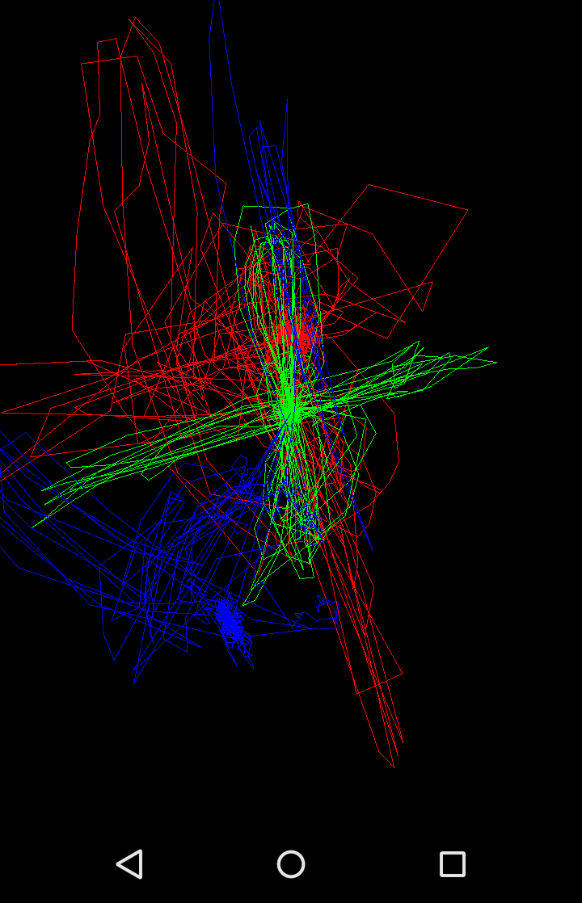

# android-sensor-particles

This app is a demonstration of a 3D particle visualization of smartphone sensors. The visualization is rendered with OpenGL ES 2.0 and the used sensors are the accelerometer (red), gyroscope (green) and magnetometer (blue).

